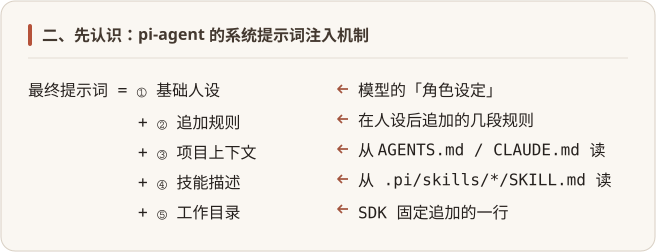
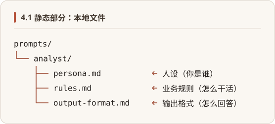

# 第 4 章：系统提示词——必须覆盖默认 Agent 人设

---

## 一、这章到底解决什么问题

Pi Agent 默认是个**通用编程助手**——它的系统提示词里，写满了「你是一个 expert coding assistant」、文件操作规范、代码审查流程之类的设定，专门为 CLI 里的代码任务优化。

但你想做的是**垂直智能体**——客服、翻译、数据分析师、合同审查员、报表生成器，这些专用角色。

这些角色跟「写代码」毫无关系。默认人设不仅没用，反而会误导模型——客服场景下，模型可能突然讲起代码语法。

要定义自己的垂直智能体，你得搞定两件事：

1. **框架默认往系统提示词里加了什么**：先看清框架默认注入了哪些内容，才知道该改哪里。
2. **怎么换掉默认人设**：聚焦改人设，其余先不用管。

---

## 二、先认识：pi-agent 的系统提示词注入机制

在讲「怎么改」之前，得先知道 pi-agent 默认会把哪些东西塞进系统提示词。

因为 pi-agent 本身就是一个 **coding agent**——它默认的系统提示词，是一整套为「在命令行里写代码」优化的人设和规则（文件操作规范、可用工具说明、文档索引……），写死在 SDK 里。你做垂直智能体（客服、翻译、分析师），这套东西不仅用不上，还会误导模型。所以第一步，得看清「框架到底塞了什么」，才知道该动哪里。

看源码（`buildSystemPrompt()`），pi-agent 最终发给 LLM 的系统提示词，是这么**五段拼装**出来的：



逐段看它们从哪来、会不会干扰你：

**① 基础人设**——这是核心，模型「是谁」全靠它。它本身有**三级来源**（按优先级回退）：

| 优先级 | 来源 |
|--------|------|
| 1（最高） | 你在代码里传的 `systemPromptOverride` |
| 2 | 文件：`{cwd}/.pi/SYSTEM.md`（项目级，需项目信任）或 `~/.pi/agent/SYSTEM.md`（全局级） |
| 3（兜底） | SDK 里写死的 `You are an expert coding assistant...`（编程助手人设） |

前两级都没有时，才回退到第 3 级那个写死的编程助手。所以你平时直接运行 `pi`（本机 `~/.pi/agent/` 下并没有 SYSTEM.md），用的就是第 3 级兜底——这也是为什么做垂直智能体**必须**主动换掉它。

**② 追加规则**——框架会从 `{cwd}/.pi/APPEND_SYSTEM.md`（项目级，需信任）或 `~/.pi/agent/APPEND_SYSTEM.md`（全局级）读追加内容。两处都没文件就是空。这是为「想保留编程助手能力、只想加几条规则」的 CLI 用户保留的方式。

**③ 项目上下文**——框架从 `cwd` 开始**向上逐级**找 `AGENTS.md` / `CLAUDE.md`，找到就塞进提示词。这是给「在代码仓库里跑 Agent」设计的自动注入项目知识机制。

**④ 技能描述**——框架扫 `{cwd}/.pi/skills/*/SKILL.md`，把技能摘要塞进**每个请求**。前提是工具集里有 `read` 工具（没有 read，模型读不了技能文件，注入也没意义）。

**⑤ 工作目录**——SDK 在末尾**无条件追加**一行 `Current working directory: /your/cwd`，告诉模型当前目录。这一行没有开关能直接关掉（要关得用扩展钩子，下一节讲）。

> **一句话总结**：①②③④⑤ 里，**只有 ① 是你做垂直智能体必须管的**。②③④ 主要是为 coding agent 设计的「自动注入项目知识」机制——你不去创建那些文件、清空追加规则，它们就是空的，不会干扰你。⑤ 基本无害，可以不管。下一节我们就聚焦 ①，讲怎么干净地换掉它。

---

## 三、二次开发实务：聚焦基础人设

看到这里你应该明白了：做垂直智能体，90% 的精力只需要花在 ① 基础人设上。②③④⑤ 不用主动去碰——**不创建对应文件，框架就不会注入多余内容**

### 3.1 基础人设怎么调

回顾 ① 的三级回退：`systemPromptOverride`（代码层）> `.pi/SYSTEM.md`（文件层）> 硬编码兜底。前两级都能换掉默认人设，下面分别介绍。

**方案一：`systemPromptOverride`（代码层，优先级最高）**

在代码里给 Loader 传一个函数，函数返回什么字符串，人设就是什么。这个字符串**既可以是写死的固定文本（静态人设），也可以是运行时拼装的内容（动态人设）**——因为是代码，你想怎么生成都行，最灵活。

**方案二：`{cwd}/.pi/SYSTEM.md`（文件层，项目级）**

把提示词写进项目根目录的 `.pi/SYSTEM.md`，框架启动时自动读取，最方便。适合「静态人设、又不想动代码」的场景。

额外提醒：

- **不要用 `~/.pi/agent/SYSTEM.md`**（全局级）。它是全局配置，**会影响你机器上所有 pi 项目**，难追踪、难管理。


### 3.2 最小例子：systemPromptOverride 的用法骨架

下面这个例子演示 `systemPromptOverride` 的用法

```typescript
import {
  createAgentSession,
  DefaultResourceLoader,   // 资源加载器：管提示词、技能、扩展等资源的加载
  getAgentDir,             // 返回全局配置目录 ~/.pi/agent
  ModelRuntime,
  SessionManager,          // 会话管理器：管对话历史的存取
} from "@earendil-works/pi-coding-agent";

const modelRuntime = await ModelRuntime.create();
const model = (await modelRuntime.getAvailable())[0];
if (!model) throw new Error("没有可用模型，请检查 ~/.pi/agent/models.json");

const loader = new DefaultResourceLoader({
  cwd: process.cwd(),          // 当前工作目录
  agentDir: getAgentDir(),     // 全局配置目录
  // ★ 换基础人设：返回什么，人设就是什么（忽略 base，彻底替换）
  systemPromptOverride: () => `你是一个企业数据分析助手，帮业务方分析销售数据、定位问题、给出建议。
回答前先确认已知信息和未知信息，不要编造数据。`,
  // ★ 清空追加规则（②），剔除 .pi/APPEND_SYSTEM.md 文件的内容（如果有的话）
  appendSystemPromptOverride: () => [],
});
await loader.reload();   // 重新加载资源（让上面的覆盖生效）

const { session } = await createAgentSession({
  model,
  modelRuntime,
  resourceLoader: loader,              // ★ 把自定义 Loader 传进去
  sessionManager: SessionManager.inMemory(),  // 用内存会话，调试不污染目录
});

try {
  session.subscribe((event) => {
    if (
      event.type === "message_update" &&
      event.assistantMessageEvent.type === "text_delta"
    ) {
      process.stdout.write(event.assistantMessageEvent.delta);
    }
  });

  console.log("💬 问：上月销售额下降了 15%，可能的原因有哪些？\n");
  await session.prompt("上月销售额下降了 15%，可能的原因有哪些？");
  console.log("\n");
} finally {
  session.dispose();
}
```

运行：`npx tsx L04-prompt/04a-replace-prompt.ts`。

核心就两行：`systemPromptOverride` 换人设、`appendSystemPromptOverride: () => []` 清空追加。`systemPromptOverride` 返回的是字符串，字符串从哪来由你决定——提示词短就写字面量（本例），长就读文件传进来（实战会演示文件层拼装）。

### 3.3 补充：那一行工作目录怎么办

⑤ 那行 `Current working directory` 在 0.83 里**没有直接关闭的开关**。但对垂直智能体来说，告诉模型「当前目录是哪」基本无害——客服、翻译、分析师都不会因此出错。

要是你确实想去掉（比如不想让模型看到真实路径），可以用**扩展的 `before_agent_start` 钩子**：系统提示词发给 LLM 前会经过它，handler 返回 `{ systemPrompt }` 就能替换本轮内容。

```typescript
import { DefaultResourceLoader, type ExtensionFactory } from "@earendil-works/pi-coding-agent";

// 扩展工厂就是一个函数，函数体里用 pi.on 注册事件
const stripCwd: ExtensionFactory = (pi) => {
  pi.on("before_agent_start", (event) => {
    // event.systemPrompt 末尾含 "\nCurrent working directory: /xxx"
    const cleaned = event.systemPrompt.replace(/\nCurrent working directory: .*$/, "");
    return { systemPrompt: cleaned };   // 返回即替换本轮系统提示词
  });
};

const loader = new DefaultResourceLoader({
  // ...其余配置省略
  extensionFactories: [stripCwd],   // ★ 扩展工厂塞进 loader
});
```

> 完整可跑示例见 `L04-prompt/04c-strip-cwd.ts`。注意：去掉这行**不影响工具的实际执行目录**（那是 SDK 按 `cwd` 配置解析的，跟模型看不看这行无关）。所以不碰文件的垂直智能体去掉它也没问题；依赖模型报相对路径的 coding agent 则留着更好。这个钩子是个**通用方法**——不只去掉 cwd，任何对最终系统提示词的修改都能用这个钩子完成，第 6 章会系统讲扩展。

---

## 四、实战：多来源拼装

到这里你已经会换人设了。但真实的垂直智能体，提示词往往不是「写死的一段话」，而是**运行时从多个来源拼装**出来的：

- **人设、业务规则、输出格式**：静态的，放本地 `.md` 文件，运营可以改；
- **用户身份、部门、数据权限**：动态的，每次请求从数据库读；
- **会话状态**（当前对话到哪一步、之前确认过什么）：从会话存储读。

为什么要拼装？因为同一个智能体服务不同用户、不同场景，提示词要**个性化**。数据分析师助手给「销售部的王小姐」和「财务部的李先生」看到的提示词，权限范围、可访问的数据集都不一样——把这些差异写死在一份提示词里不现实，运行时拼装才是正确做法。

下面用「企业数据分析师助手」演示：人设/规则/输出格式从文件读，用户上下文从数据库读，运行时拼成完整提示词。

### 4.1 静态部分：本地文件



`prompts/analyst/persona.md`：

```markdown
你是一个专业的企业数据分析师助手，帮业务方分析数据、定位问题、给出建议。
```

`prompts/analyst/rules.md`：

```markdown
## 工作规则
1. 面对业务问题，先确认已知信息和未知信息
2. 给出可能的原因分析，按可能性从高到低排序
3. 对每个可能的原因，建议验证方法（看哪些数据、做什么对比）
4. 不要编造数据，未知就说未知
5. 只涉及当前用户有权访问的数据范围
```

`prompts/analyst/output-format.md`：

```markdown
## 回答格式
- 先给结论（一两句话），再展开分析
- 用要点格式列举可能原因
- 每个原因后附"验证方法：..."
- 最后给一句行动建议
```

### 4.2 动态部分：从数据库读用户上下文

每个登录用户的身份、部门、数据权限都不同。这些信息存在业务数据库里，每次请求按 userId 查出来：

```typescript
// 假装这是你的用户服务——实际从用户表/权限系统读
async function getUserContext(userId: string) {
  // 下面 Record<string, {...}> 是 TS 的「字典类型」标注：表示 users 是个对象，
  // 键是字符串（如 "u001"），值是 { name, department, role, dataScope } 这种结构。
  // 看不懂没关系——它只给编辑器看，运行时就是个普通 JS 对象。
  const users: Record<string, { name: string; department: string; role: string; dataScope: string }> = {
    "u001": { name: "王小姐", department: "销售部", role: "销售经理", dataScope: "本部门销售数据" },
    "u002": { name: "李先生", department: "财务部", role: "财务分析师", dataScope: "全公司财务数据" },
  };
  return users[userId] ?? { name: "未知用户", department: "未知", role: "访客", dataScope: "无" };
}
```

### 4.3 拼装代码

新建 `L04-prompt/04b-layered-prompt.ts`：

```typescript
import { readFile } from "fs/promises";
import { join } from "path";
import {
  createAgentSession,
  DefaultResourceLoader,
  getAgentDir,
  ModelRuntime,
  SessionManager,
} from "@earendil-works/pi-coding-agent";

const modelRuntime = await ModelRuntime.create();
const model = (await modelRuntime.getAvailable())[0];
if (!model) throw new Error("没有可用模型，请检查 ~/.pi/agent/models.json");

// ★ 静态部分：启动时一次性读到内存（运营改文件后重启生效）
const PROMPTS_DIR = join(process.cwd(), "prompts", "analyst");
// Promise.all：让三个读文件操作并行执行，全部完成后再一起往下走
// 左边 [persona, rules, outputFormat] 是「解构赋值」：把返回的数组按顺序拆成三个变量
const [persona, rules, outputFormat] = await Promise.all([
  readFile(join(PROMPTS_DIR, "persona.md"), "utf-8"),
  readFile(join(PROMPTS_DIR, "rules.md"), "utf-8"),
  readFile(join(PROMPTS_DIR, "output-format.md"), "utf-8"),
]);

// ★ 动态部分：每次请求从"数据库"读用户上下文
async function getUserContext(userId: string) {
  // 下面 Record<string, {...}> 是 TS 的「字典类型」标注：表示 users 是个对象，
  // 键是字符串（如 "u001"），值是 { name, department, role, dataScope } 这种结构。
  // 看不懂没关系——它只给编辑器看，运行时就是个普通 JS 对象。
  const users: Record<string, { name: string; department: string; role: string; dataScope: string }> = {
    "u001": { name: "王小姐", department: "销售部", role: "销售经理", dataScope: "本部门销售数据" },
    "u002": { name: "李先生", department: "财务部", role: "财务分析师", dataScope: "全公司财务数据" },
  };
  return users[userId] ?? { name: "未知用户", department: "未知", role: "访客", dataScope: "无" };
}

// 模拟一次请求：用户 u001 登录后问问题
const userId = "u001";
const userContext = await getUserContext(userId);

// ★ 拼装：静态文件 + 动态用户上下文
const fullPrompt = [
  persona,
  `## 当前用户上下文
姓名：${userContext.name}
部门：${userContext.department}
角色：${userContext.role}
数据权限范围：${userContext.dataScope}
（回答时只涉及该用户有权访问的数据范围）`,
  rules,
  outputFormat,
].join("\n\n");

const loader = new DefaultResourceLoader({
  cwd: process.cwd(),
  agentDir: getAgentDir(),
  systemPromptOverride: () => fullPrompt,
  appendSystemPromptOverride: () => [],
});
await loader.reload();

const { session } = await createAgentSession({
  model,
  modelRuntime,
  resourceLoader: loader,
  sessionManager: SessionManager.inMemory(),
});

try {
  session.subscribe((event) => {
    if (
      event.type === "message_update" &&
      event.assistantMessageEvent.type === "text_delta"
    ) {
      process.stdout.write(event.assistantMessageEvent.delta);
    }
  });

  console.log(`💬 用户 ${userContext.name}（${userContext.department}）问：上月销售额下降 15%，可能的原因有哪些？\n`);
  await session.prompt("上月销售额下降了 15%，可能的原因有哪些？");
  console.log("\n");
} finally {
  session.dispose();
}
```

运行：`npx tsx L04-prompt/04b-layered-prompt.ts`。

这段代码的核心，是 `fullPrompt` 的拼装——**静态文件**（人设/规则/输出格式）+ **动态数据**（用户上下文）。多来源拼装的好处：

- **静态部分**（文件）：运营改文案不用动代码，版本管理 diff 清晰；
- **动态部分**（数据库）：每个用户看到个性化提示词，权限边界明确；
- **两者解耦**：改规则不用碰用户逻辑，反之亦然。

真实项目里，动态来源可能更多——会话状态、外部 API 返回的实时数据快照、配置中心的灰度开关。思路都一样：每个来源独立获取，最后 `join` 成一段。

> **什么时候该拆成多个 Agent？** 要是两套提示词**人设完全不同**（一个是客服、一个是分析师），那本质是两个不同的智能体，应该独立成两个 Agent 服务。本章的「多来源拼装」，是**同一个智能体内部**把人设、规则、用户上下文组合起来——是组织提示词的工程技巧，不是「一个服务装多种角色」。

---

到这里，你已经能定义自己的垂直智能体了——换人设、清空干扰、分层管理提示词。

但 Agent 真正的威力，在「调工具」——让它能查你的数据库、调你的内部 API、执行你的业务逻辑。下一章，我们就讲怎么写自定义工具。


---

## 附录：知识点—源码对照（v0.83.0）

> 本章涉及的 API / 机制，在 v0.83.0 中的源码位置。**行号会随版本漂移**，定位时以符号名为主、行号为辅。

| 知识点 | 源码位置 | 一句话说明 |
|--------|---------|-----------|
| 系统提示词五段拼装 | `system-prompt.ts:28-72`（customPrompt 路径）; `74-162`（默认路径） | 人设→追加规则→项目上下文→技能→cwd |
| `systemPromptOverride` | `resource-loader.ts:191,527` | `(base)=>string|undefined`，返回值彻底替换 |
| 基础人设回退链 | `resource-loader.ts:525-527`（override 链）; `:1022-1034`（SYSTEM.md 发现）; `system-prompt.ts:121-138`（硬编码默认） | override > options.systemPrompt > SYSTEM.md > 硬编码 |
| `appendSystemPromptOverride` 清空追加规则 | `resource-loader.ts:193,539-541`；`agent-session.ts:1038-1040` | 返回 [] → `join` 后 length=0 → `appendSystemPrompt=undefined` |
| SYSTEM.md / APPEND_SYSTEM.md 路径 | `resource-loader.ts:1022-1048`（发现逻辑）; `config.ts:491,515-520`（CONFIG_DIR_NAME + getAgentDir） | 项目级 `{cwd}/.pi/`（需项目信任）+ 全局 `~/.pi/agent/`（不需信任） |
| 项目上下文向上找 AGENTS.md/CLAUDE.md | `resource-loader.ts:118-156` | 从 cwd dirname 逐级到根，外加全局 agentDir |
| 技能描述需 read 工具 | `system-prompt.ts:64-67`（customPrompt 路径）; `:101,155`（默认路径 hasRead 检查） | 无 read 工具则不拼技能段 |
| `Current working directory` 无条件追加 | `system-prompt.ts:69`（customPrompt 路径）; `:159`（默认路径） | 没有开关，要关得用扩展钩子 |
| 技能目录（项目级+全局级） | `skills.ts:431-432` | `{cwd}/.pi/skills/` + `~/.pi/agent/skills/` |
| `before_agent_start` 替换本轮 | `extensions/runner.ts:1076-1140`；`agent-session.ts:1247,1069` | 返回 `{systemPrompt}` 链式覆盖，finally 逐轮复位 |
| `DefaultResourceLoader` 选项 | `resource-loader.ts:158-193`（Options 接口） | cwd / agentDir / extensionFactories / systemPromptOverride / appendSystemPromptOverride / ... |
